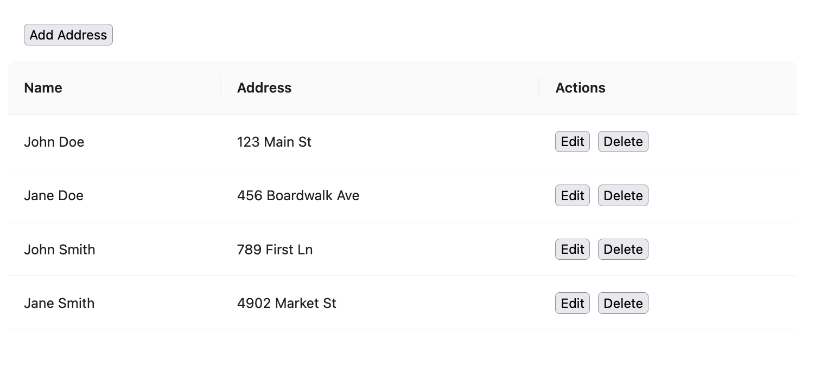

# Address Table

Address table in TypeScript and React using antd's `Table` library.

Create, edit, and delete address entries.

## How to run

In the project directory, run `npm install` then `npm start`.

Open [http://localhost:3000](http://localhost:3000) to view it in your browser.
